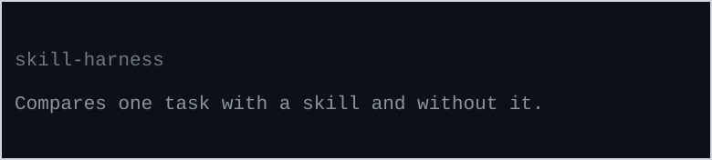

<p>
  <picture>
    <source media="(prefers-color-scheme: dark)" srcset="assets/banner-dark.svg">
    
  </picture>
</p>

# Skill Harness

[](https://github.com/MrBinnacle/skill-harness/actions/workflows/ci.yml)
[](https://www.python.org/downloads/)
[](LICENSE)

**You installed a skill that's supposed to make your AI assistant better. Is it actually doing
anything?**

Skills ride along in every conversation and take up context space, so a skill that does nothing
isn't free — it's dead weight. This tool measures whether a skill earns its slot: it runs the
same task **with** the skill and **without** it, and compares. You get one of three honest
answers: *it helped*, *it didn't*, or *this can't be measured yet* — and that third answer comes
back labeled `UNMEASURED` instead of a made-up score.

Most benchmarks hand you a number no matter what. This tool refuses. That refusal is the product.

> **Status: pre-alpha, honestly.** v0.1 measures style-level effects with a single-turn subject.
> Our own published findings say that aim is too narrow for the question most people actually
> have ("does this skill earn its slot?") — the correction is pre-registered in
> [`docs/findings/v0.2-reaim-gate.md`](docs/findings/v0.2-reaim-gate.md). This repo practices
> what it measures: the findings that invalidated our own v0.1 design are published, not
> papered over.

## The question other skill evals don't answer

Most skill-evaluation tools **score the skill file itself** — lint it, have an LLM judge grade
it, simulate runs against it. That answers *"is this artifact well-made?"* It's a reasonable
question. It is not the question that decides an install.

The question that decides an install is *"is my agent measurably better with this than without
it?"* — and the only way to answer it is a paired comparison against the no-skill baseline.
That's what this harness does, with three properties the certification-style tools don't have:

1. **A control arm.** Every measurement is with-vs-without, not a score in a vacuum. Frontier
   models often ace the task with no skill at all — in our own testing, *"the model already does
   this fine"* has been the most common truthful result. A score-in-a-vacuum can't tell you that.
2. **An honest failure mode.** When the evidence doesn't support a verdict — too noisy, task too
   easy, judge uncalibrated — the answer is `UNMEASURED`, stored and first-class, never an
   estimate that launders noise into a finding.
3. **A paper trail.** Evidence admissibility is checked and snapshotted at write time in an
   append-only store. Every number can show its work; inadmissible data is kept but never
   aggregated.

This harness is also the instrument behind the evidence records in
[MrBinnacle/skills](https://github.com/MrBinnacle/skills) — a living skill collection where
skills are re-screened on each major model release and publicly retired when models stop
needing them.

## 60-second start — no API key, no cost

```bash
pip install git+https://github.com/MrBinnacle/skill-harness
skill-harness skill audit path/to/your/SKILL.md
```

Two commands to your first verdict. `skill audit` is fully offline: a structural check against
[Anthropic's authoring spec](https://platform.claude.com/docs/en/agents-and-tools/agent-skills/best-practices),
plus a preview of what a paid run could measure about this skill today and which claims would
come back `UNMEASURED`. Real output:

```text
OFFLINE AUDIT — no API calls, no cost
  skill:  caveman
  body:   41 lines / 233 words

  PASS  name            name 'caveman' meets spec
  PASS  body-length     body 41 lines (budget 500)
  INFO  description-unparsed-block-scalar
        description uses a multi-line YAML block scalar, which this audit's
        minimal frontmatter parser cannot read — checks skipped
        (UNMEASURED, not passed)

Evaluability preflight — what a paid run could measure today:
  Tier-1 mechanical axes: citation_presence_per_flag, compliance_proxy,
  hedge_index, structure_score, verbosity (style-shaped only).
  Behavior-shaped claims (correctness, tool use, outcomes): no mechanical
  instrument in v0.1 → verdict would be UNMEASURED, not an estimate.

Summary: 3 pass · 0 warn — UNMEASURED is a verdict, not a failure.
```

Note the third line of that report: when the tool can't read something, it says so and skips
the check — it does not pass what it did not measure. That's the whole design, applied at every
layer. `--strict` exits 1 on warnings for CI use. On Windows terminals, set `PYTHONUTF8=1`
first.

## Measuring for real (API key required)

```bash
skill-harness skill init path/to/SKILL.md --execute   # extract testable claims
skill-harness run ablation <skill_id> --execute        # run the with/without comparison
skill-harness run evaluate-skill <skill_id>            # aggregate verdicts
```

Both `skill init` and `run ablation` accept **either** `ANTHROPIC_API_KEY` (direct) or
`OPENROUTER_API_KEY` (auto-routed). Every `run` command is dry-run by default; `--execute` is
required to spend money, and per-run/daily budget caps are enforced. Reproduction script and
details: [`examples/`](examples/).

## What it measures today — and what it refuses to

v0.1's honest scope: directional effects on **style** (verbosity, hedging, structure, citation
presence), measured claim by claim with a single-turn subject. Behavior-shaped claims —
correctness, tool use, outcomes — have no mechanical instrument in v0.1 and return
`UNMEASURED`. LLM-judge verdicts count **only** from a calibrated (judge, axis) pair:
position-swapped, length-controlled, injection-defended, with human agreement measured before a
single judged verdict is admitted
([`docs/concepts/why-unmeasured.md`](docs/concepts/why-unmeasured.md)).

The pre-registered v0.2 re-aim ([gate doc](docs/findings/v0.2-reaim-gate.md)): whole-skill
with-vs-without becomes the primary contrast, an agentic multi-turn subject joins the
single-turn adapter, outcome oracles (tests-pass, lint delta, diff size, turns, cost) join the
mechanical set — and the harness configuration itself becomes an admissibility condition,
because published agentic-benchmark experience puts harness-induced variance at 10–20 points on
identical model weights, larger than most skill effects.

## How it compares

|  | **skill-harness** | [skill-eval-harness](https://github.com/adewale/skill-eval-harness) | [promptfoo](https://github.com/promptfoo/promptfoo) | [Inspect](https://github.com/UKGovernmentBEIS/inspect_ai) |
|---|---|---|---|---|
| Primary question | is this claim about a skill backed by *admissible* evidence? | did this skill improve outcomes on my cases? | which prompt/config is better/safer? | how does this model/agent score? |
| Unit | claim (v0.1) → whole skill (v0.2) | whole skill, paired with/without + component ablations | prompt/config matrix | task/eval |
| When evidence is weak | **refuses**: `UNMEASURED` verdict; inadmissible rows are stored but never aggregate | flags: oracle tiers, critical-severity veto, audit warnings | — | — |
| LLM judges | admissible only from a calibrated (judge, axis) pair | user-supplied judge command, uncalibrated by design | judge/rubric assertions | model-graded scorers |
| Maturity | pre-alpha | active v0.5.x | mature, 23k+ stars | mature, institutional |

Honest guidance: if you want the most *featureful* skill benchmarking today, use adewale's
skill-eval-harness. Use this harness when what you care about is whether the number deserves to
exist.

## Why this exists

With-vs-without skill benchmarking at 3 runs apiece is now common practice, and it is
trap-laden: run-to-run noise (we measured ±17.6% on agentic tasks) swallows all but huge
effects; hand-matched tasks quietly bias the result; pass/fail test banks price a skill's
*cost* while structurally missing its *benefit*; and synthetic test oracles leak their own
answers through docstrings. The measured findings, with evidence grades:
[`docs/findings/why-naive-skill-benchmarks-mislead.md`](docs/findings/why-naive-skill-benchmarks-mislead.md).
The independent literature agrees on the stakes: low-quality skills don't just fail to help —
they actively degrade performance. A tool that can honestly say "no measurable effect" is the
missing instrument.

## Dig deeper

- [`docs/case-studies/ai-slop-sentinel-under-ablation.md`](docs/case-studies/ai-slop-sentinel-under-ablation.md)
  — the discipline catching its own author three times before a contaminated result could
  ship. The deliverable is the chain of refusals, not a number.
- [`docs/case-studies/double-ceiling-structurally-unmeasured.md`](docs/case-studies/double-ceiling-structurally-unmeasured.md)
  — a frontier agent passed 14/14 no-skill runs on two deliberately hardened tasks: on that
  task class there is nothing for a skill to improve, and any benchmark claiming otherwise owes
  you its no-skill pass rate first.
- [`docs/case-studies/displaced-enforcement-skill-ablation-blind-spot.md`](docs/case-studies/displaced-enforcement-skill-ablation-blind-spot.md)
  — a scope boundary of skill-ablation: when a discipline's real firing lives in a hook, not in
  the model reading the skill, ablating the text measures the wrong layer — so a null there is
  not the discipline's verdict, and to measure the discipline you ablate the hook instead.
- [`docs/PRD.md`](docs/PRD.md) — full specification: evidence model, oracle tiers,
  admissibility rules, CLI surface.
- Evidence store: `src/skill_harness/storage/migrations_sql/evidence/` (append-only,
  trigger-enforced) + `migrations_sql/runtime/` (mutable operational state).

MIT licensed. Issues and PRs welcome — see [`CONTRIBUTING.md`](CONTRIBUTING.md).
